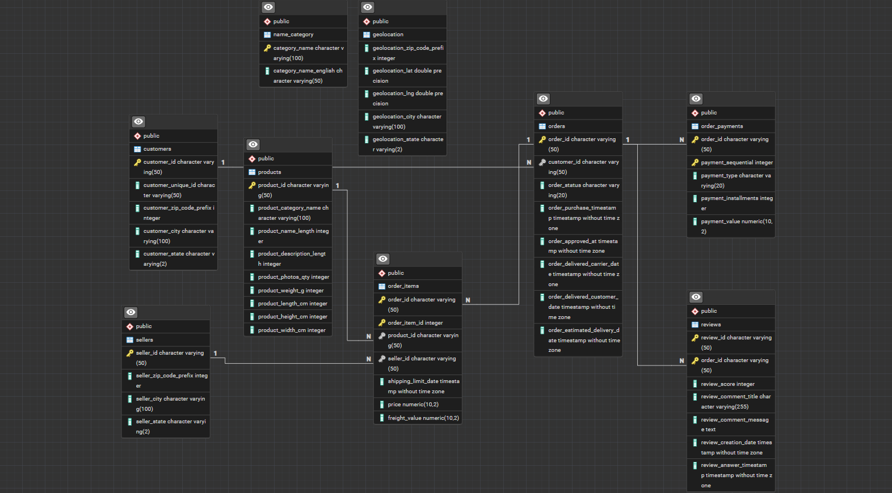
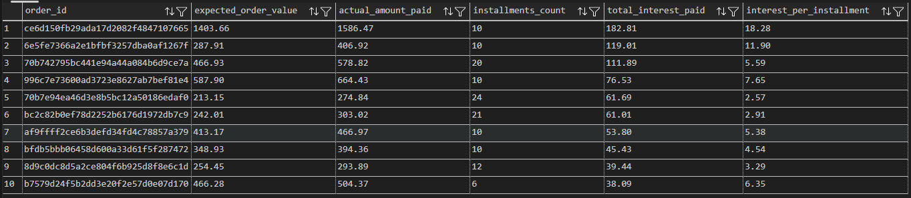

# 📂 Database Setup & Data Ingestion

Este módulo constituye el núcleo de datos del proyecto. Aquí se gestiona desde la creación de la infraestructura física y la ingesta de datos, hasta la validación de calidad y la creación de capas analíticas.

## 1) Contexto y Propósito
El objetivo de este script es transformar archivos planos (CSV) en una base de datos relacional robusta. En el contexto de Olist, esto es crítico porque:
* **Normalización:** Permite cruzar la información de clientes, vendedores y productos sin redundancias.
* **Trazabilidad:** Establece las reglas para entender el ciclo de vida de una orden, desde la compra hasta la reseña del cliente.

## 2) Fase 1: Creación e Ingesta (01_schema_and_load.sql) 🏗️

En esta etapa se define la estructura técnica del proyecto. Se priorizaron decisiones que garantizan la precisión y la escalabilidad:

* **Precisión Financiera:** Se utiliza el tipo de dato `DECIMAL(10,2)` para los campos de precio, flete y pagos. A diferencia del tipo `FLOAT`, este evita errores de redondeo acumulativos en cálculos de Revenue.
* **Trazabilidad Temporal:** Uso de `TIMESTAMP` para todos los hitos logísticos, permitiendo cálculos precisos de intervalos (SLA).
* **Eficiencia de Ingesta:** Se empleó el comando `COPY` de PostgreSQL para una carga masiva y eficiente de los archivos CSV originales en formato UTF-8.

### 1.1 Diagrama de Entidad-Relación (ERD) 🗺️

A continuación se presenta la arquitectura lógica de la base de datos de Olist, destacando las relaciones entre las 9 tablas principales:

*Figura 1: Esquema relacional que muestra la integridad referencial y las claves compuestas.*

### 1.2 Diccionario de Datos Completo 📖

| Tabla | Tipo | Descripción |
| :--- | :--- | :--- |
| `customers` | Dimensión | Datos de clientes y ubicación. |
| `products` | Dimensión | Catálogo con dimensiones físicas de productos. |
| `sellers` | Dimensión | Información de los vendedores del marketplace. |
| `name_category`| Referencia | Traducción de categorías (Portugués -> Inglés). |
| `geolocation` | Referencia | Coordenadas geográficas por código postal. |
| `orders` | Hechos | Cabecera del pedido (Status y Timestamps). |
| `order_items` | Hechos | Detalle de productos, precios y fletes por pedido. |
| `order_payments`| Hechos | Transacciones, métodos de pago y cuotas. |
| `reviews` | Hechos | Calificaciones y comentarios de los usuarios. |

### 1.3 Hallazgos Clave 💡

* **Granularidad de Clientes:** La distinción entre `customer_id` y `customer_unique_id` permite rastrear el comportamiento recurrente del usuario a través de múltiples órdenes.
* **Consistencia de Datos:** Durante la ingesta se validó la codificación `UTF8` para preservar los caracteres especiales del portugués brasileño en nombres de ciudades y categorías.

## 3) Fase 2: Pre-procesamiento y Calidad de Datos (02_pre_processing_analysis.sql) 🔍

Antes de generar métricas de negocio, se ejecutó un análisis de integridad exhaustivo. Este paso es fundamental para asegurar que las visualizaciones en Power BI no contengan sesgos por datos ruidosos o reglas de negocio no identificadas.

### 2.1 Auditoría de Flujo Logístico (Nulos en Fechas) 🧪

Tras auditar los estados de las órdenes frente a sus fechas de cumplimiento, se obtuvieron los siguientes resultados que validan la consistencia del dataset:

| Estado del Pedido | Total Pedidos | Fechas Nulas | Conclusión de Calidad |
| :--- | :--- | :--- | :--- |
| **delivered** | 96,478 | 8 | **Alta Integridad:** Solo 0.008% de error en registro de entrega. |
| **shipped** | 1,107 | 1,107 | **Consistencia Lógica:** Pedidos en tránsito correctamente sin fecha final. |
| **canceled** | 625 | 619 | **Excepción:** 6 pedidos cancelados reportan entrega (posible retorno). |

### 2.2 Resolución de Conflictos Geográficos (Duplicados) 📍

Se validó la cardinalidad de la tabla `geolocation` para prevenir errores de duplicidad en reportes espaciales.
* **Hallazgo:** El campo `geolocation_zip_code_prefix` presenta múltiples registros de latitud/longitud por cada código postal.
* **Impacto en el Modelo:** Esta duplicidad impide el uso del código postal como Primary Key. Se documenta que cualquier JOIN con esta tabla debe realizarse tras un proceso de agregación (promedio de coordenadas) para evitar el efecto de "explosión de filas" (*fan-out effect*).

### 2.3 Auditoría de Integridad Financiera e Intereses 💰

Se realizó una validación cruzada entre el monto esperado (Precio + Flete) y el monto efectivamente pagado en la pasarela de pagos, dividida en dos etapas:

* **Fase A (Identificación de Diferencias):** Se detectaron discrepancias donde el pago real superaba el valor del carrito. Se estableció un umbral de tolerancia de 0.1 para ignorar errores mínimos por redondeo.
* **Fase B (Validación de Hipótesis):** Se cruzaron las diferencias con el número de cuotas (`payment_installments`). 
* **Conclusión de Negocio:** Se confirmó que el dataset de Olist incluye **costos de financiamiento**. El excedente de pago corresponde a intereses que crecen proporcionalmente al número de cuotas elegidas por el cliente.

 

*Figura 2: Detalle de pedidos con intereses por cuotas, confirmando el costo de financiamiento.*

| Métrica Analizada | Hallazgo Técnico | Implicación de Negocio |
| :--- | :--- | :--- |
| **Diferencia de Montos** | `actual_payment > expected_total` | Identificación de ingresos por financiamiento vs. venta. |
| **Costo por Cuotas** | `interest_per_installment` > 0 | Validación de la lógica de intereses del marketplace. |
| **Umbral de Tolerancia** | 0.1 (BRL) | Eliminación de ruido por precisión decimal en PostgreSQL. |

> **💡 Insight de Portafolio:** Esta auditoría demuestra que el modelo no presenta errores de duplicidad financiera, sino que refleja fielmente la realidad del crédito al consumo en el mercado brasileño.

## 4) Guía de Ejecución ⚙️
1. **Preparación:** Crear la base de datos `olist_analytics` y asegurar la conexión.
2. **Infraestructura e Ingesta:** Ejecutar `01_schema_and_load.sql`.

   > **Nota:** Actualizar las rutas del comando `COPY` a la ubicación local de tus archivos CSV.

3. **Validación de Calidad:** Ejecutar `02_pre_processing_analysis.sql` para verificar la integridad de la carga y auditar nulos.
4. **Capa Analítica (Próximamente):** Ejecutar `03_views.sql` para generar las tablas finales de Power BI.

