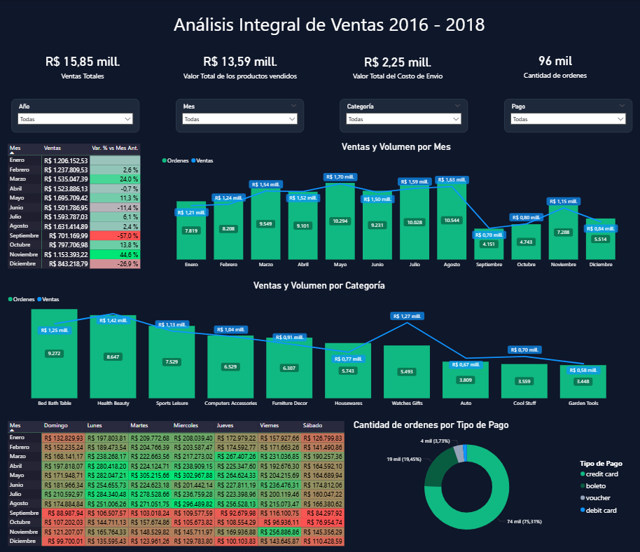
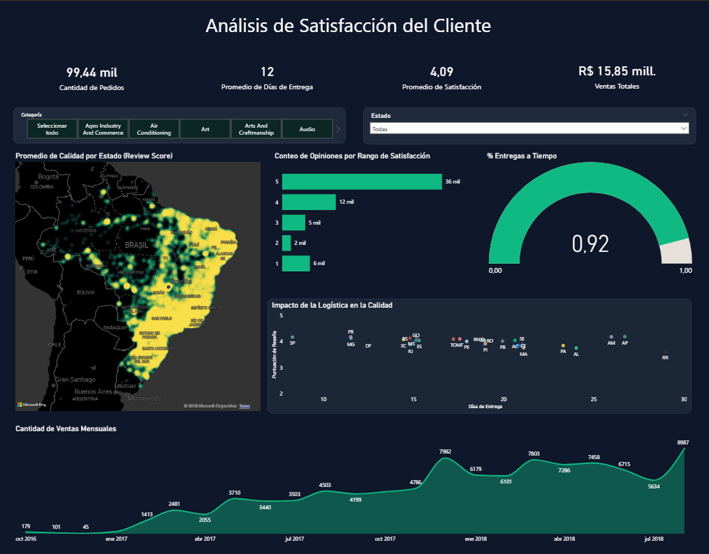

# 📊 Power BI – Dashboards de Análisis

Este módulo contiene los dashboards interactivos construidos sobre las vistas generadas en PostgreSQL. El archivo `.pbip` conecta directamente con la base de datos y consume las vistas definidas en `/sql_queries/01_views.sql` como fuente principal de datos.

---

## 1) Contexto y Propósito

El objetivo de esta capa es transformar los datos relacionales de Olist en visualizaciones accionables que respondan preguntas clave de negocio. El proyecto contiene dos dashboards independientes, cada uno enfocado en un dominio de análisis distinto.

---

## 2) Dashboards

### 2.1 Análisis Integral de Ventas 💰

Reporte enfocado en el comportamiento comercial del negocio durante el período 2016–2018.


*Figura 1: Vista general del dashboard de ventas.*

**Visuals incluidas:**

| Visual | Descripción |
| :--- | :--- |
| KPIs superiores | Ventas totales, valor de productos, costo de envío y cantidad de órdenes |
| Tabla mensual | Ventas por mes con variación porcentual respecto al mes anterior |
| Gráfico barras + línea (mes) | Volumen de órdenes y ventas totales por mes |
| Gráfico barras + línea (categoría) | Volumen de órdenes y ventas totales por categoría |
| Matriz días de semana | Ventas cruzadas por mes y día de la semana con formato condicional |
| Dona | Distribución de ventas por método de pago |

**Hallazgos principales:**

- **Mayo** fue el mes con mayor volumen de ventas del período, alcanzando **R$ 1.7** millones.
- Los meses posteriores a agosto registraron los niveles más bajos del año, con excepción de **noviembre**, que presentó la mayor subida porcentual intermensual con un **+44.6%** respecto al mes anterior.
- **Agosto** concentra la mayor cantidad de productos vendidos, sin embargo su valor total de ventas es inferior al de mayo, lo que sugiere un ticket promedio más bajo en ese período.
- **Health Beauty** es la categoría con mayores ingresos totales, mientras que **Bed Bath Table** lidera en volumen de productos vendidos.
- **Watches Gifts** es una categoría destacada: siendo la séptima en volumen, se posiciona como la segunda en ingresos totales, superando el promedio general.
- Aproximadamente el **75%** de las compras se realizan con tarjeta de crédito, siendo el método de pago ampliamente dominante.

---

### 2.2 Análisis de Satisfacción del Cliente ⭐

Reporte enfocado en la experiencia del cliente, cruzando calificaciones, tiempos de entrega y cobertura geográfica.


*Figura 2: Vista general del dashboard de satisfacción del cliente.*

**Visuals incluidas:**

| Visual | Descripción |
| :--- | :--- |
| KPIs superiores | Cantidad de pedidos, promedio de días de entrega, promedio de satisfacción y ventas totales |
| Mapa de calor | Promedio de calidad por estado (Review Score) |
| Gráfico de barras | Conteo de opiniones por rango de satisfacción (1 a 5) |
| Medidor (gauge) | Porcentaje de entregas a tiempo |
| Scatter plot | Impacto de los días de entrega sobre la puntuación de reseña por estado |
| Gráfico de área | Cantidad de ventas mensuales a lo largo del período |

**Hallazgos principales:**

- El promedio general de satisfacción es de **4.09 sobre 5**, con las calificaciones de 5 estrellas siendo ampliamente dominantes (**36 mil opiniones**).
- El **92%** de los pedidos fueron entregados a tiempo.
- El scatter plot evidencia una correlación negativa entre los días de entrega y la puntuación de reseña — a mayor tiempo de entrega, menor satisfacción del cliente.

---

## 3) Medidas DAX Relevantes 📐

### `Variación % Mes Anterior`
Calcula el cambio porcentual de ventas respecto al mes inmediatamente anterior, operando correctamente en contexto de filtro por mes.
```DAX
Variación % Mes Anterior = 
VAR _mesActual =
    SELECTEDVALUE('Resumen de Ventas'[Mes Numero])
VAR _ventasActual = 'Finanzas y Cuotas'[Total Sales]
VAR _ventasAnterior =
    CALCULATE(
        'Finanzas y Cuotas'[Total Sales],
        FILTER(
            ALL('Resumen de Ventas'),
            MONTH('Resumen de Ventas'[order_date]) = _mesActual - 1
        )
    )
RETURN
    IF(
        NOT ISBLANK(_ventasAnterior) && _ventasAnterior <> 0,
        DIVIDE(_ventasActual - _ventasAnterior, _ventasAnterior),
        BLANK()
    )
```

---

### `% Entregas a Tiempo`
Calcula la proporción de pedidos entregados en o antes de la fecha estimada de entrega.
```DAX
% Entregas a Tiempo = 
DIVIDE(
    SUM('Logística y Entregas'[is_on_time]), 
    COUNT('Logística y Entregas'[order_id])
)
```

---

### `Average Category Score`
Calcula el promedio de puntuación de reseña filtrado por el contexto de categoría activo en el visual.
```DAX
Average_Category_Score = 
CALCULATE(
    AVERAGE('Satisfacción (reviews)'[review_score]),
    CROSSFILTER('Resumen de Ventas'[order_id], 'Puente Ordenes'[order_id], Both)
)
```

---

## 4) Decisiones de Diseño 🎨

- **Paleta de colores:** Se utilizó una combinación de verde y amarillo sobre fondo oscuro, inspirada en los colores de la bandera de Brasil, país de origen del dataset.
- **Idioma:** Todos los títulos, etiquetas y textos están estandarizados en español.
- **Canvas:** Lienzo personalizado de **1500 × 1200px** para garantizar una visualización completa sin scroll.

---

## 5) Guía de Ejecución ⚙️

1. Asegúrate de haber ejecutado previamente los scripts de `/database` y `/sql_queries`.
2. Abre el archivo `Olist_Sales_Analysis_v1_2026-02-12.pbip` en **Power BI Desktop**.
3. Ve a **Transformar datos → Configuración de origen** y actualiza la cadena de conexión a tu instancia local de PostgreSQL.
4. Haz clic en **Actualizar** para cargar los datos desde las vistas.