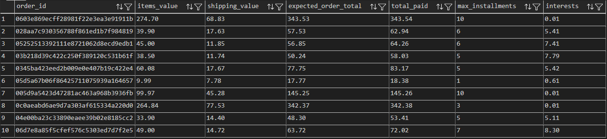
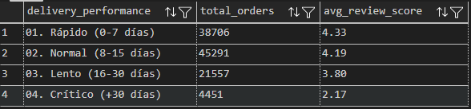
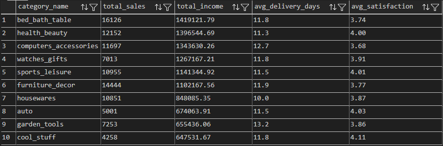

# 📈 Business Intelligence & Transformation Layer

Esta carpeta contiene la inteligencia analítica del proyecto. Aquí transformamos los datos crudos en una **Capa Semántica** mediante vistas optimizadas y consultas de alto nivel que responden a preguntas críticas de negocio.

## 1) Capa Semántica (01_views.sql) 🏗️
Para simplificar el consumo de datos y asegurar la consistencia de las métricas, se crearon vistas lógicas que actúan como "tablas maestras" para Power BI:

* **`v_orders_cleaned`**: Filtra pedidos entregados y calcula el tiempo real de entrega en días.

* **`v_order_summary`**: Consolida la venta con su categoría (traducida al inglés), cliente y estado del vendedor.

* **`v_order_finance_details`**: **Investigación Forense.** Separa el valor del carrito de los ingresos generados por intereses bancarios.

*Captura 1: Verificación de la vista financiera; se observa el cálculo automático de intereses cuando el monto pagado excede el valor del carrito.*

* **`v_clean_geolocation`**: Resuelve la duplicidad de coordenadas mediante la agregación por promedio de latitud y longitud por código postal.

## 2) Lógica de Negocio y KPIs (02_business_logic.sql) 💡
En esta sección se ejecutan las consultas de alto impacto que alimentarán los reportes estratégicos:

### 📍 A. Análisis Geográfico y Market Share
Utilizamos **Window Functions** (`OVER()`) para calcular el peso relativo de cada estado en la facturación total.
* **Insight:** Identificación de estados con alto volumen pero bajo ticket promedio vs. mercados premium.

### 💰 B. Economía del Crédito y Flujo de Caja
Analizamos el comportamiento de los clientes que financian sus compras.
* **Métrica Clave:** Cálculo del "Ticket Mensual" (`avg_monthly_installment`) para entender el compromiso financiero del consumidor según el número de cuotas.

### 🚚 C. Correlación: Logística vs. Satisfacción
Segmentamos el rendimiento de entrega en 4 niveles (Rápido, Normal, Lento, Crítico).
* **Hallazgo Crítico:** Determinación del punto de quiebre donde el puntaje de reseña cae drásticamente debido al tiempo de espera.

*Captura 2: Resultado del análisis de correlación; evidencia estadística de la degradación de la experiencia del cliente ante retrasos logísticos.*

### 🏆 D. Ranking de Rentabilidad 360°
Un Top 10 que cruza tres dimensiones: **Ingresos**, **Eficiencia Logística** y **Satisfacción del Cliente**. No solo vemos qué se vende más, sino qué categorías son operativamente saludables.

*Captura 3: Dashboard tabular de rentabilidad por categoría, integrando volumen de ventas, ingresos, logística y satisfacción.*